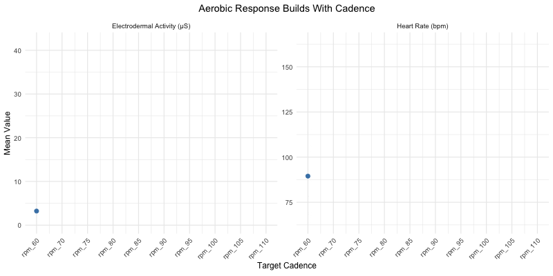

```{r setup}
#| include: false
source("setup.R")
```


```{=html}
<style>
/* 1. Page Background */
body, html, main, .cr-section, section {
  background-color: #eef2f6 !important;
  font-family: -apple-system, BlinkMacSystemFont, "Segoe UI", Roboto, Helvetica, Arial, sans-serif;
  color: #0f172a
}

/* Condition palette */
.c-stress { color: orange; font-weight: 600; }
.c-aero   { color: steelblue; font-weight: 600; }
.c-anaero { color: seagreen; font-weight: 600; }


/* Intro and closing panels outside the scroll section */
.hero, .closer {
  max-width: 48rem;
  margin: 3rem auto;
  font-size: 1.05rem;
  line-height: 1.7;
  background: #ffffff;
  padding: 2.5rem;
  border-radius: 12px;
  box-shadow: 0 4px 20px rgba(0, 0, 0, 0.05);
  border: 1px solid #e2e8f0;
}
.hero .cue { 
  opacity: 0.7; 
  font-size: 0.95rem; 
  margin-top: 2rem; 
  font-weight: 600;
  color: #2563eb;
}

/* 2. Closeread Section Layout */
.cr-section {
  max-width: 1150px !important;
  margin: 0 auto !important;
  padding: 0 1.5rem !important;
  background-color: transparent !important;
}

/* Colour for the scrolling text */
.cr-section .narrative { color: #0f2233; }
.cr-section .narrative-col { 
  max-width: 26rem !important; 
  padding-right: 2rem !important;
  }
.transition h1 { color: #0f2233;
  font-weight: 700;
  font-size: 1.8rem;
  display: inline-block;
  padding-bottom: 0.35rem;
}

/* 3. Floating Chart Sticky Container */
.cr-section .sticky-col {
  background-color: #ffffff !important;
  border-radius: 12px !important;
  padding: 1rem 1.25rem !important;
  box-shadow: 0 12px 30px -10px rgba(0, 0, 0, 0.08) !important;
  border: 1px solid #e2e8f0 !important;
  transition: box-shadow 0.2s ease;
}


/* Internal cleanups to prevent plot displacement */
.cr-section .sticky-col .sticky-col-stack > div,
.cr-section div[id^="cr-"] {
  background: transparent !important;
  border: none !important;
  box-shadow: none !important;
  padding: 0 !important;
  margin: 0 !important;
  display: flex !important;
  align-items: center !important;
  justify-content: center !important;
  width: 100%;
}

/* Trim excessive white space inside ggplot svg/images without breaking Closeread */
.cr-section div[id^="cr-"] img,
.cr-section div[id^="cr-"] svg,
.cr-section div[id^="cr-"] .cell-output-display {
  border-radius: 8px;
  background: transparent !important;
  display: block !important;
  margin: 0 auto !important;
  max-height: 72vh !important;
  width: auto !important;
}

/* Footer Data Source Citation */
.data-source {
  max-width: 48rem;
  margin: 4rem auto 3rem auto;
  padding-top: 1.5rem;
  border-top: 1px solid #cbd5e1;
  font-size: 0.85rem;
  line-height: 1.6;
  color: #64748b;
  background: transparent !important;
  box-shadow: none !important;
}

.data-source strong {
  color: #334155;
}

.data-source a {
  color: #2563eb;
  text-decoration: underline;
  text-underline-offset: 2px;
}

.data-source a:hover {
  color: #1d4ed8;
}
</style>
```

::: {.hero}
**Introduction**

Wearable trackers reduce a person to a few numbers, and they market themselves on the promise that your heart rate, your skin conductance and movement can reveal what you are doing and even how you are feeling. The researchers who created this dataset wanted to test that promise on three states: <span class="c-stress">stress</span>, <span class="c-aero">aerobic exercise</span>, and <span class="c-anaero">anaerobic exercise</span>, with a particular interest in clinical applications, such as whether these devices could reliably distinguish emotional arousal from physical exertion.

Their interest was primarily clinical. These three states move blood glucose in different directions: acute stress tends to raise it, aerobic exercise tends to lower it, and anaerobic exercise can raise it again. For someone with type 1 diabetes, whose insulin is increasingly dosed by an automated artificial-pancreas system, knowing which state a person is in tells the system which way their glucose is likely heading. A wristband that could separate stress from exercise, and one kind of exercise from the other, would be genuinely useful.

**Methods**

Their interest was primarily clinical. To test it, thirty-six participants wore an Empatica E4, a research-grade wrist device, across the three kinds of conditions. Thirty completed the full set, while the remaining six only took part in the stress session. The sessions were run in two groups of eighteen with slightly different versions of the protocol, which is why some comparisons here are limited to a single version.

**The Test Conditions**

**1. Stress conditions**

- Cognitive tasks designed to provoke a reaction: Stroop test, timed mental arithmetic, arguing against own opinions
- Rest periods between tasks
- Self-reported stress rating at each stage

**2. Aerobic conditions**

- Graded stationary bike ride
- Cadence stepped up in stages, from warm-up to hard finish

**3. Anaerobic conditions**

- All-out sprints against heavy resistance
- Recovery period after each sprint

Throughout, the device recorded heart rate, skin conductance (i.e., electrodermal activity as a proxy for sympathetic arousal), and movement in the form of a three-axis accelerometer reading collapsed into a single per-second measure of how much the body was moving. The study also recorded skin temperature and heart rate variability, but those readings were unreliable in this dataset and are left out of the analysis.

Thus, this project uses the dataset to examine whether and how clearly, the wearable's recorded signals differ across the three conditions, as a test of whether the device can distinguish stress from physical exertion.


[Scroll down to learn more about their results]{.cue}
:::

::: {.transition style="text-align: center; max-width: 40rem; margin: 4rem auto;"}
# What Do These Markers Tell Us?
Can heart rate distingish between stress, aerobic and anaerobic test conditions?

:::


::: {.cr-section }

Heart rate rises with physical activity. Here, stress consistently registers a lower heart rate than either exercise condition, suggesting that heart rate alone can meaningfully separate stress from physical exertion. @cr-s1-stress

<!-- Scene 1a -->
:::{#cr-s1-stress}
```{r scene-1a-stress}
# HR quantiles per condition
hr_quantiles <- labelled_clean %>%
  filter(signal == "HR", !subject %in% invalid_hr) %>%
  group_by(condition) %>%
  summarise(p10 = quantile(value, 0.1),
            median = median(value),
            p90 = quantile(value, 0.9))

# HR range shared by AEROBIC and ANAEROBIC (overlap of their p10-p90)
aero_range <- hr_quantiles %>% filter(condition == "AEROBIC")
anaero_range <- hr_quantiles %>% filter(condition == "ANAEROBIC")
overlap_lo <- max(aero_range$p10, anaero_range$p10)
overlap_hi <- min(aero_range$p90, anaero_range$p90)

# STRESS keeps colour, the two exercise conditions are greyed out
scene1a_stress <- labelled_clean %>%
  filter(signal == "HR", !subject %in% invalid_hr) %>%
  ggplot(aes(condition, value, fill = condition)) +
  geom_violin(alpha = 0.7) +
  geom_boxplot(width = 0.15, outlier.size = 0.4) +
  scale_fill_manual(
    values = c(cond_cols["STRESS"], AEROBIC = "grey75", ANAEROBIC = "grey75"),
    guide = "none"
  ) +
  labs(
    title = str_wrap("Heart Rate Separates Stress From Aerobic And Anaerobic", 60),
    subtitle = paste0(""),
    x = NULL, y = "Heart Rate (bpm)"
  ) +
  theme_minimal(base_size = 12) +
  theme(plot.title = element_text(hjust = 0.5),
        plot.subtitle = element_text(hjust = 0.5))
scene1a_stress
```
:::

:::{#cr-scene1-exer}
```{r scene-1a-exer}

scene1a <- labelled_clean %>%
  filter(signal == "HR", !subject %in% invalid_hr) %>%
  ggplot(aes(condition, value, fill = condition)) +
  # grey band spans the AEROBIC and ANAEROBIC violins
  annotate("rect", xmin = 1.5, xmax = 3.5,
           ymin = overlap_lo, ymax = overlap_hi,
           fill = "grey30", alpha = 0.3) +
  geom_violin(alpha = 0.7) +
  geom_boxplot(width = 0.15, outlier.size = 0.4) +
  scale_fill_manual(values = cond_cols, guide = "none") +
  labs(
    title = str_wrap("Heart Rate Separates Stress From Exercise, But Can't Distinguish Between Exercise Types", 60),
    subtitle = paste0("Shaded band: HR range shared by AEROBIC and ANAEROBIC (",
                       round(overlap_lo), "–", round(overlap_hi), " bpm)"),
    x = NULL, y = "Heart Rate (bpm)"
  ) + 
  theme_minimal(base_size = 12) +
  theme(plot.title = element_text(hjust = 0.5),
        plot.subtitle = element_text(hjust = 0.5))
scene1a 
```
:::

However, heart rate does not reliably distinguish between the aerobic and anaerobic conditions. The two conditions occupy an almost identical heart rate range (as indicated by the shaded band), meaning a single heart rate reading within this range is insufficient to determine whether a participant was cycling or performing an all-out sprint. @cr-scene1-exer

The accelerometer (ACC) also separates stress from the exercise states cleanly, as expected given that participants remained largely stationary during the cognitive tasks. However, despite being designed to capture motion, the sensor does not distinguish between the two exercise types: steady rhythmic cycling and short explosive sprints produce similar average motion when measured across a session. As with heart rate, then, the ACC signal indicates whether a participant is exercising, but not which type of exercise is being performed. @cr-scene1-move

<!-- Scene 1b -->
:::{#cr-scene1-move}
```{r scene-1b}

# Average HR and average movement for each session
session_means <- labelled_clean %>%
  filter(signal %in% c("HR", "ACC_movement")) %>%
  group_by(subject, condition, signal) %>%
  summarise(mean_value = mean(value)) %>%
  # One row per session
  pivot_wider(names_from = signal, values_from = mean_value)
scene1b <- ggplot(session_means, aes(ACC_movement, HR, colour = condition)) +
  geom_point(size = 2.5, alpha = 0.8) +
  scale_colour_manual(values = cond_cols) +
  labs(title = "Session-level HR vs Movement (Acceleration)", 
       x = "Mean Movement (ACC)", y = "Mean Heart Rate (bpm)") + 
  theme_minimal(base_size = 12) +
  theme(plot.title = element_text(hjust = 0.5),
        plot.subtitle = element_text(hjust = 0.5))
scene1b
```
:::

:::

::: {.transition style="text-align: center; max-width: 40rem; margin: 4rem auto;"}
# What can we learn by examining each stage?
So far, the data have been aggregated across the full duration of each condition, which appears to mask meaningful differences between the aerobic and anaerobic states. But what happens if we instead examine values at each stage of a given condition?
:::

::: {.cr-section}
In the aerobic condition, the cadence is raised in steps, and the body responds in step with it. Heart rate and skin conductance both climb as the pace does, and while individuals vary in how steeply they respond, the direction is mostly consistent across participants. As the effort increases, the response grows with it, and the wearable captures that intensity well as long as the task is physical and graded. @cr-scene2

*Note: This plot is restricted to version 1, as its aerobic protocol steps cadence up in a clean graded ramp from 60 to 110 rpm. Version 2 is structured differently with a cool-down, so pooling the two would blur the results.*


<!-- Scene 2-->
```{r scene2}
#| eval: false

# labelled_clean %>%
#   filter(condition == "AEROBIC") %>%
#   distinct(version, phase) %>%
#   arrange(version, phase) %>%
#   print(n = 50)

# The ten aerobic cadence steps from the v1 graded protocol in increasing order
cadence <- c("rpm_60","rpm_70","rpm_75","rpm_80","rpm_85",
             "rpm_90","rpm_95","rpm_100","rpm_105","rpm_110")

# Mean HR and EDA per cadence for each participant and the cohort
# v1 only as the aerobic protocol steps cadence up in a clean graded ramp in this version
aero_participant <- labelled_clean %>%
  filter(condition == "AEROBIC", version == "v1",
         signal %in% c("HR", "EDA"), phase %in% cadence) %>%
  mutate(phase = factor(phase, levels = cadence)) %>%
  group_by(signal, phase, subject) %>%
  summarise(subject_mean = mean(value))

aero_cohort <- aero_participant %>%
  group_by(signal, phase) %>%
  summarise(cohort_mean = mean(subject_mean))

# Map each cadence to a step number as gganimate reveals along a numeric x-axis
cadence_step <- tibble(phase = factor(cadence, levels = cadence),
                       step = seq_along(cadence))

aero_participant_anim <- aero_participant %>% left_join(cadence_step, by = "phase")
aero_cohort_anim <- aero_cohort %>% left_join(cadence_step, by = "phase")

# Aerobic response across cadence steps
# grey lines = individual participants; blue line = cohort mean
p <- ggplot(aero_participant_anim, aes(step, subject_mean)) +
  geom_line(aes(group = subject), colour = "grey80") +
  geom_line(data = aero_cohort_anim, aes(step, cohort_mean, group = 1),
            colour = "steelblue", linewidth = 1.2) +
  geom_point(data = aero_cohort_anim, aes(step, cohort_mean),
             colour = "steelblue", size = 2.5) +
  facet_wrap(~ signal, scales = "free_y",
             labeller = as_labeller(c(HR = "Heart Rate (bpm)", EDA = "Electrodermal Activity (µS)"))) +
  # Relabel the step numbers back to cadence names on the x-axis
  scale_x_continuous(breaks = cadence_step$step, labels = cadence,
                     guide = guide_axis(angle = 45)) +
  labs(title = "Aerobic Response Builds With Cadence",
       x = "Target Cadence", y = "Mean Value") +
  # Draw the lines progressively across cadence steps
  transition_reveal(step) +
  theme_minimal(base_size = 12) +
  theme(plot.title = element_text(hjust = 0.5),
        plot.subtitle = element_text(hjust = 0.5))

# Render to a gif
aero_animation <- animate(
  p, nframes = 100, fps = 10, width = 800, height = 400,
  renderer = gifski_renderer()
)

# Save for embedding
anim_save("scene2_aerobic.gif", aero_animation)
```

:::{#cr-scene2}

:::

# A Composite Number Masks Trends
A single averaged heart rate value can also be misleading. Although aerobic and anaerobic exercise occupy a similar heart rate range, the two conditions do not share the same temporal pattern. When heart rate is tracked across the full session rather than collapsed into a single summary value, the two conditions reveal clearly distinct trajectories. @cr-scene3

<!-- Scene 3 -->
:::{#cr-scene3}
```{r scene3}

# Three participants with both exercise conditions and no split recordings
scene3_participants <- c("S02", "S04", "S08")

# HR over the full session for each participant in aerobic and anaerobic conditions
scene3 <- signals %>%  # 'signals' shows the whole session, not just the tagged phases
  filter(subject %in% scene3_participants, signal == "HR",
         condition %in% c("AEROBIC", "ANAEROBIC")) %>%
  ggplot(aes(t, value, colour = condition)) +
  geom_line() +
  scale_colour_manual(values = cond_cols, guide = "none") +
  facet_grid(subject ~ condition, scales = "free_x") +
  labs(title = "Same Participants With Different Heart Rate Patterns Over Time",
       subtitle = "One sustained climb in Aerobic vs repeated sprint-and-recovery in Anaerobic",
       x = "Seconds", y = "Heart Rate (bpm)") +
   theme_minimal(base_size = 12) +
   theme(plot.title = element_text(hjust = 0.5),
        plot.subtitle = element_text(hjust = 0.5))

scene3
```
:::

<span class="c-aero">Aerobic</span> effort is one long gradual climb. As the cadence rises, heart rate rises with it towards a single sustained peak and then is brought down during the cool-down. [@cr-scene3]{scale-by="1.5" pan-to="40%,0%"}

<span class="c-anaero">Anaerobic</span> effort is the opposite and follows a cyclical pattern. Each sprint burst drives the heart rate up and the recovery then pulls it back down, repeating periodically. [@cr-scene3]{scale-by="1.5" pan-to="-40%,0%"}

This is evident for all three participants shown here. It suggests that the same person might reach a similar range of heart rates in both conditions, but can have completely different trajectories over time.  @cr-scene3
 
# Anaerobic Exercise Comes with a Cost
 
The anaerobic pattern does more than just repeat. Across the four sprints, both the peak heart rate and the mean skin conductance rise from one sprint to the next. This demonstrates that later sprints demand a larger response than earlier ones. A single averaged number for the overall session would thus mask the fatigue that grows from one stage to another. @cr-scene4

<!-- Scene 4 -->
:::{#cr-scene4}
```{r scene4}
# --- Scene 4 --- #

# The four anaerobic sprints
sprints <- c("sprint_1", "sprint_2", "sprint_3", "sprint_4")

# Max heart rate per sprint (captures the intensity of each maximal effort)
sprint_hr <- labelled_clean %>%
  filter(condition == "ANAEROBIC", signal == "HR", phase %in% sprints) %>%
  group_by(subject, phase) %>%
  summarise(hr_peak = max(value))

# Mean skin conductance per sprint (captures the sustained sweat response level)
sprint_eda <- labelled_clean %>%
  filter(condition == "ANAEROBIC", signal == "EDA", phase %in% sprints) %>%
  group_by(subject, phase) %>%
  summarise(eda_mean = mean(value))

# One panel per signal
p_hr <- sprint_hr %>%
  ggplot(aes(phase, hr_peak)) +
  geom_boxplot(fill = "darkgreen", alpha = 0.6, outlier.size = 0.5) +
  labs(title = "Peak Heart Rate", x = "Sprint", y = "Peak Heart Rate (bpm)") +
  theme_minimal(base_size = 12)

p_eda <- sprint_eda %>%
  ggplot(aes(phase, eda_mean)) +
  geom_boxplot(fill = "darkgreen", alpha = 0.6, outlier.size = 0.5) +
  labs(title = "Mean Skin Conductance", x = "Sprint", y = "Mean Electrodermal Activity (µS)") +
  theme_minimal(base_size = 12)

# Compose side by side with a shared title
scene4 <- p_hr + p_eda +
  plot_annotation(
    title = "Anaerobic Cost Accumulates Across Sprints",
    subtitle = "Recovery is incomplete as each sprint elicits a larger response than the last",
    theme = theme(plot.title = element_text(hjust = 0.5),
                  plot.subtitle = element_text(hjust = 0.5))
  )

scene4
```
:::

:::

::: {.transition style="text-align: center; max-width: 40rem; margin: 4rem auto;"}
# Do Participants Experience Stress the Same Way?
It is clear that exercise patterns followed the task in a predictable way and its responses were large and easy to see in most participants. But what about the stress response as measured by skin conductance?

*Note: Skin conductance (EDA) during exercise is affected by movement and sweat, so it cannot be read as a clean measure of arousal.The two plots below are drawn from the stress sessions alone as people are sitting still and movement is less likely to be confounding the results.*
:::

::: {.cr-section}

Measured against each participant's own resting baseline, the stress response is faint and inconsistent. Using each participant's largest rise across the five tasks as the measure, only twenty of the thirty-six participants show a clear response above a conservative threshold of 0.5 µS. The remaining sixteen show minimal change, and a few even record a maximum value below their own baseline. @cr-scene5-rank

<!-- Scene 5 -->
:::{#cr-scene5-rank}
```{r scene5-rank}

# 1) Each participant's largest EDA rise ranked
scene5_rank <- responders %>%
  ggplot(aes(fct_reorder(subject, max_task_diff), max_task_diff, colour = responder)) +
  geom_hline(yintercept = 0, colour = "grey85") +
  geom_hline(yintercept = 0.5, linetype = "dashed", colour = "grey50") +   # responder threshold
  geom_segment(aes(xend = subject, y = 0, yend = max_task_diff), linewidth = 0.5) +
  geom_point(size = 2) +
  scale_colour_manual(
    values = c("TRUE" = cond_cols[["STRESS"]], "FALSE" = "grey60"),
    labels = c("TRUE" = "Meaningful rise", "FALSE" = "No meaningful rise"),
    name = NULL
  ) +
  coord_flip() +
  labs(title = "Largest EDA Rise Above Own baseline, Ranked By Participant",
       subtitle = paste0(sum(responders$responder), " of ", nrow(responders),
                         " participants cross the 0.5 µS threshold"),
       x = NULL, y = "Max EDA rise above own baseline (µS)") +
  theme_minimal(base_size = 12) +
  theme(axis.text.y = element_text(size = 6))
scene5_rank
```
:::

Moreover, splitting the responses across all eight phases (including baseline and rests) does not provide much clarity either. The one task that clearly lifts the middle of the group is the Stroop test with a median roughly 0.5 µS above baseline, whereas the others sit close to zero at their median and look more active only because of a handful of strong responders. Even the rest periods are barely distinguishable from most of the tasks. While exercise revealed one shared trend across stages, stress seems to give something closer to thirty-six separate stories. @cr-scene5-phases

:::{#cr-scene5-phases}
```{r scene5-phases}
# 2) EDA by stress phase, relative to each person's baseline
 
# Readable phase names for the x-axis
phase_labels <- c(baseline = "Baseline", stroop = "Stroop", tmct = "TMCT",
                  real_opinion = "Real Opinion", opposite_opinion = "Opposite Op.",
                  subtract = "Subtraction", first_rest = "Rest 1", second_rest = "Rest 2")
 
phase_order <- names(phase_labels)

# 2. Add highlight flag for the main driver
eda_styled <- eda_diff %>%
  mutate(
    phase = factor(phase, levels = phase_order),
    is_stroop = phase == "stroop"
  )

# 3. Create the styled ggplot object
scene5_phases <- eda_styled %>%
  ggplot(aes(x = phase, y = diff)) +
  # Baseline zero reference line
  geom_hline(yintercept = 0, linetype = "dashed", colour = "#94a3b8", linewidth = 0.6) +
  # Boxplots: Highlight Stroop in stress accent color, keep rest subtle grey
  geom_boxplot(
    aes(fill = is_stroop, color = is_stroop), 
    width = 0.45, 
    outlier.shape = NA, 
    alpha = 0.75, 
    linewidth = 0.6
  ) +
  # Individual participant jitter points
  geom_jitter(
    aes(color = is_stroop),
    width = 0.12, 
    alpha = 0.35, 
    size = 1.1
  ) +
  coord_cartesian(ylim = c(-2.5, 4.5)) +
  scale_x_discrete(labels = phase_labels) +
  # Dynamic fills and strokes based on condition color
  scale_fill_manual(
    values = c("TRUE" = cond_cols[["STRESS"]], "FALSE" = "#cbd5e1"), 
    guide = "none"
  ) +
  scale_color_manual(
    values = c("TRUE" = cond_cols[["STRESS"]], "FALSE" = "#64748b"), 
    guide = "none"
  ) +
  # Direct annotation highlighting the key insight
  annotate(
    "text", x = "stroop", y = 4.1, 
    label = "Stroop Test\n(Primary Stress Driver)", 
    size = 3.2, 
    color = cond_cols[["STRESS"]], 
    fontface = "bold",
    vjust = 0
  ) +
  labs(
    title = "Skin Conductance Across Stress Phases",
    subtitle = "Relative to each participant's baseline (0 µS)",
    x = NULL, 
    y = "EDA Change (µS)"
  ) +
  theme_minimal(base_size = 12) +
  theme(
    plot.title = element_text(face = "bold", size = 13, color = "#0f172a", hjust = 0.5),
    plot.subtitle = element_text(size = 10, color = "#64748b", hjust = 0.5, margin = margin(b = 10)),
    axis.text.x = element_text(angle = 45, hjust = 1, vjust = 1, color = "#334155", face = "bold"),
    axis.text.y = element_text(color = "#64748b"),
    axis.title.y = element_text(color = "#334155", size = 10, margin = margin(r = 8)),
    panel.grid.major.x = element_blank(),
    panel.grid.minor = element_blank(),
    panel.grid.major.y = element_line(color = "#f1f5f9")
  )

scene5_phases
 
# Median EDA change for baseline, tasks and rests
# eda_diff %>%
#   mutate(phase_type = case_when(
#     phase == "baseline"    ~ "Baseline",
#     phase %in% task_phases ~ "Task",
#     TRUE                   ~ "Rest"
#   )) %>%
#   group_by(phase_type) %>%
#   summarise(median_diff = median(diff), n = n())
```
:::

:::

::: {.transition style="text-align: center; max-width: 40rem; margin: 4rem auto;"}
# Does Subjective Stress Match Objective Stress?
So the EDA signal is inconsistent across both stages and people. That said, for the participants whose skin did react during the tasks, did that strong physiological response line up with whether they actually reported feeling stressed?
:::

::: {.cr-section}

Plotting self-reported stress against skin conductance response shows the two are essentially unrelated (r = 0.06). Not only does the wearable struggle to register stress, but participants' own ratings fail to predict their physiological response. Self-reported stress offers almost no insight into skin conductance. @cr-scene6

Only about a third (the minority) of participants fall into agreement (high report with high reaction, or low with low). The two largest groups are disagreements: thirteen participants whose skin conductance rose despite reporting below-median stress, and ten who reported high stress with minimal corresponding EDA increase.

<!-- Scene 6 -->
:::{#cr-scene6}
```{r scene6}
# Largest task-phase EDA per participant (95th percentile is robust to single spikes)
eda_peak <- labelled_clean %>%
  filter(condition == "STRESS", signal == "EDA", phase %in% task_phases) %>%
  group_by(subject) %>%
  summarise(peak_val = quantile(value, 0.95))

# Peak as a percentage rise above each person's own baseline
eda_rise <- baseline_eda %>%
  inner_join(eda_peak, by = "subject") %>%
  mutate(rise_pct = (peak_val - baseline) / baseline * 100) # % rather than raw µS because baseline EDA varies considerably

# Mean self-reported stress per participant across the five task phases
report_mean <- self_report %>%
  filter(phase %in% task_phases) %>%
  group_by(subject) %>%
  summarise(self_report_mean = mean(rating))

# Combine rise, self-report and the shared responder flag
felt_v_measured <- eda_rise %>%
  inner_join(report_mean, by = "subject") %>%
  inner_join(responders, by = "subject") %>%
  mutate(
    high_report = self_report_mean > median(self_report_mean),
    # split into four quadrants
    quadrant = case_when(
      responder  & high_report  ~ "Agreement (high-high)",
      !responder & !high_report ~ "Agreement (low-low)",
      responder  & !high_report ~ "Reaction, no reported feeling",
      !responder & high_report  ~ "Reported feeling, no reaction"
    )
  )

# Medians for the quadrant dividing lines
med_report <- median(felt_v_measured$self_report_mean)
med_rise   <- median(felt_v_measured$rise_pct)

# correlation test
corr_test  <- cor.test(felt_v_measured$rise_pct, felt_v_measured$self_report_mean)

scene6 <- ggplot(felt_v_measured, aes(x = self_report_mean, y = rise_pct)) +
  # shade the two disagreement quadrants
  annotate("rect", xmin = -Inf, xmax = med_report, ymin = med_rise, ymax = Inf,
           fill = "grey85", alpha = 0.4) +
  annotate("rect", xmin = med_report, xmax = Inf, ymin = -Inf, ymax = med_rise,
           fill = "grey85", alpha = 0.4) +
  # median lines to divide the four quadrants
  geom_hline(yintercept = med_rise, linetype = "dashed", colour = "grey50") +
  geom_vline(xintercept = med_report, linetype = "dashed", colour = "grey50") +
  geom_point(aes(colour = responder), size = 3, alpha = 0.85) +
  scale_colour_manual(
    values = c(`TRUE` = "orange", `FALSE` = "grey20"),
    labels = c(`TRUE` = "Physiological responder", `FALSE` = "Non-responder"),
    name = NULL
  ) +
  # label in each corner (anchored to panel edges, not data extremes)
  annotate("text", x = -Inf, y = Inf,
           label = "Reaction,\nno reported feeling", hjust = -0.05, vjust = 1.3,
           size = 3.2, colour = "grey30", fontface = "italic") +
  annotate("text", x = Inf, y = Inf,
           label = "Agreement\n(high-high)", hjust = 1.05, vjust = 1.3,
           size = 3.2, colour = "grey30", fontface = "italic") +
  annotate("text", x = -Inf, y = -Inf,
           label = "Agreement\n(low-low)", hjust = -0.05, vjust = -0.3,
           size = 3.2, colour = "grey30", fontface = "italic") +
  annotate("text", x = Inf, y = -Inf,
           label = "Reported feeling,\nno reaction", hjust = 1.05, vjust = -0.3,
           size = 3.2, colour = "grey30", fontface = "italic") +
  # y-axis as a percentage
  scale_y_continuous(labels = label_percent(scale = 1),
                   limits = c(-300, NA)) +
  labs(
    x = "Mean self-reported stress across task phases (0–10)",
    y = "Largest EDA rise above baseline",
    title = "Felt Stress And Measured Stress Are Unrelated",
    subtitle = sprintf("r = %.2f, p = %.2f (n = %d). No relationship between what people say and how their skin reacts",
                        corr_test$estimate, corr_test$p.value, nrow(felt_v_measured))
  ) +
  theme_minimal(base_size = 12) +
  theme(legend.position = "bottom", plot.title.position = "plot") +
  theme(plot.title = element_text(hjust = 0.5),
        plot.subtitle = element_text(hjust = 0.5))
scene6

# count of participants in each quadrant
# felt_v_measured %>%
#   count(quadrant, name = "participants") %>%
#   arrange(desc(participants)) %>%
#   kable(col.names = c("Quadrant", "Participants"))
```
:::

The two most extreme physiological responses in the sample, rises approaching 2000%, belong to participants who also reported high stress. While it is tempting to read this as evidence that EDA and self-report can align under intense conditions, this is only observed in two people out of thirty-six. [@cr-scene6]{scale-by="2.5" pan-to="-60%,60%"}

:::

::: {.closer}

In sum, wearable signals reliably indicate when the body is active, cleanly separating exercise from stress. Beyond that distinction, however, the picture is less clear. The two exercise types are distinguishable only by examining the temporal shape of the signal, since their averages converge by the end of the session. Stress is harder still to capture via skin conductance: the response is small when present at all, does not track the tasks systematically, and varies widely across individuals. Compounding this, physiological response and self-reported experience are often unrelated.

For any application that needs to distinguish stress from exercise, this last gap is a substantial limitation. The wearable's promise that a handful of numbers can reveal what a person is doing and how they are feeling should therefore be treated with caution.
:::

## Explore It Yourself
 
To explore any individual participant across conditions, or compare responses across demographic subgroups, use the companion Shiny app.
 
 
## Conclusion
 
Wrist-worn devices reliably detect physical exertion and differentiate movement from resting states. However, identifying specific types of exercise requires tracking metrics over time rather than relying on session averages.
 
Measuring psychological stress presents a greater challenge. Skin conductance responses during stress tasks are variable, inconsistent across individuals, and weakly correlated with self-reported feelings.
 
For clinical applications like automated insulin delivery where distinguishing stress from physical activity is critical, wearable sensors provide valuable signals, but their output must be interpreted with caution.
 
 
## Data & Methodological Limitations
 
* **No Independent Clinical Ground Truth:** Analyses rely entirely on protocol labels rather than secondary physiological benchmarks like cortisol or lactate levels.
* **Excluded Temperature Data:** The skin temperature sensor produced 3,631 invalid readings (up to 235 °C) and was removed from analysis.
* **Baseline Volatility:** Raw baseline skin conductance varied by more than 200× across participants (0.12 to 29 µS), making within-person baseline adjustments necessary.
* **Motion Contamination:** Physical movement during exercise affects skin conductance and heart rate readings, obscuring pure sympathetic stress signals.
* **Small and homogeneous sample:** The sample only includes thirty-six young, healthy adults, so the findings are purely descriptive for this small cohort. The dataset may not generalise to older, clinical, or more varied populations.
 
::: {.data-source}
<strong>Data Source:</strong> Hongn, A., et al. (2025). <em>Wearable Device Dataset from Induced Stress and Structured Exercise Sessions</em> (v1.0.1). PhysioNet. <a href="https://doi.org/10.13026/he0v-tf17" target="_blank">doi.org/10.13026/he0v-tf17</a>
:::